# Core workout
Els noms dels eercicis son inventats

## Boleta invertida
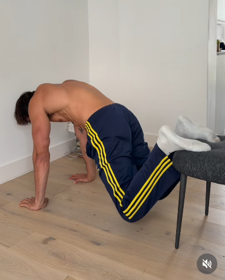
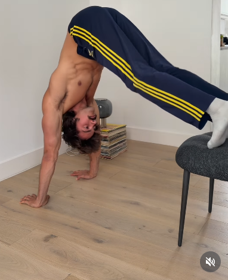

## Si la Barqueta es tomba
També es pot fer amb una kettlebell o peses agafades a la mà

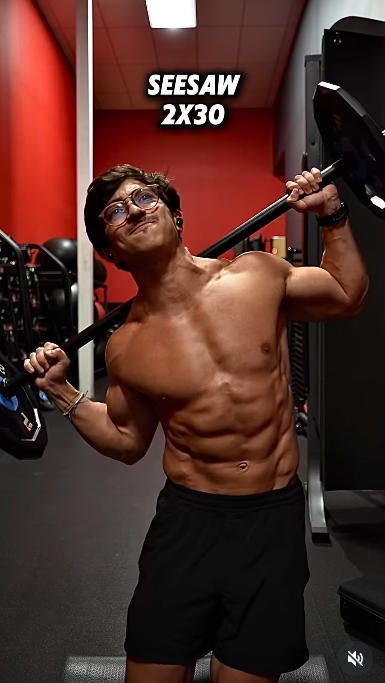
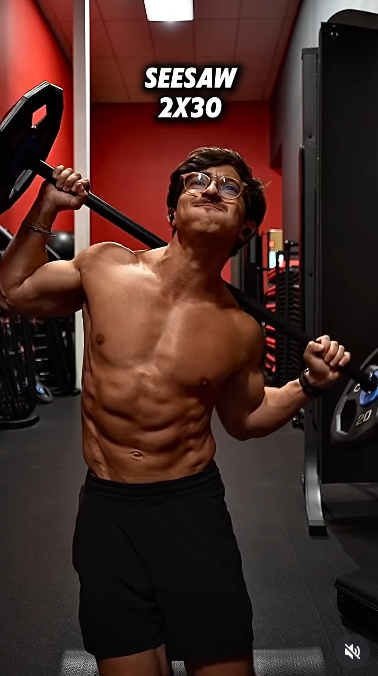

## Side Ball Throws (Sentat)
Es important rotar el tronc

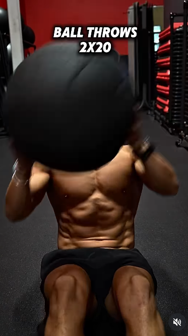
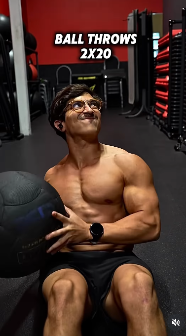
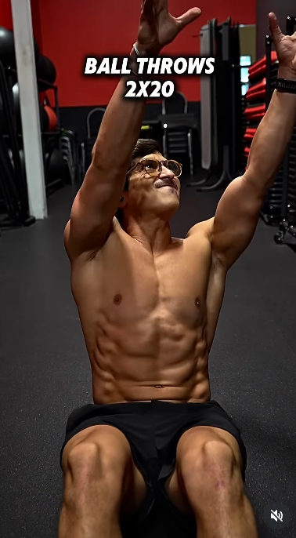

## Landmine Swings

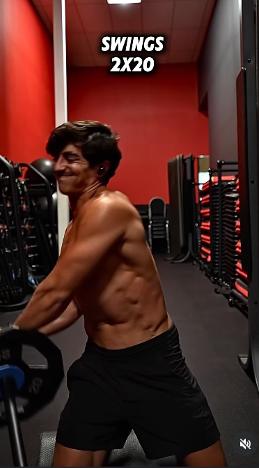
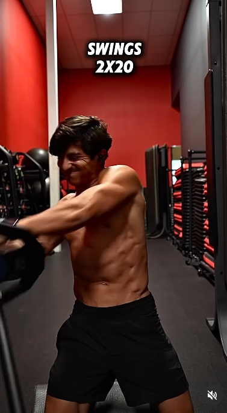
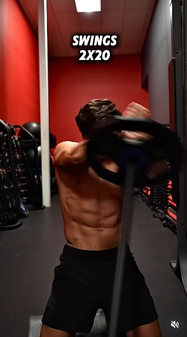
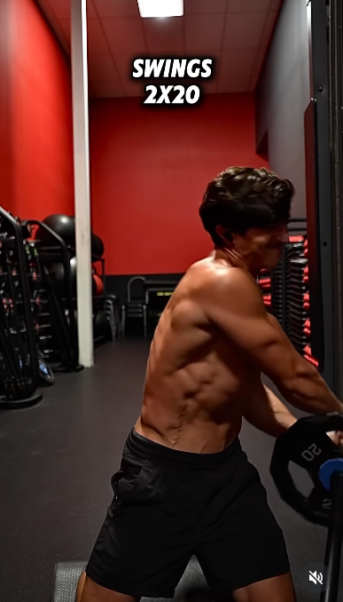