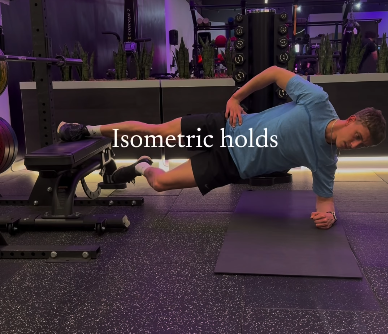
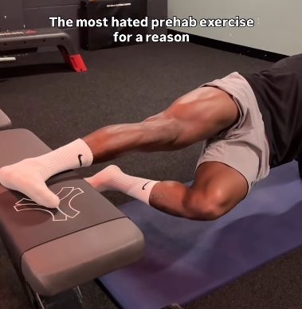
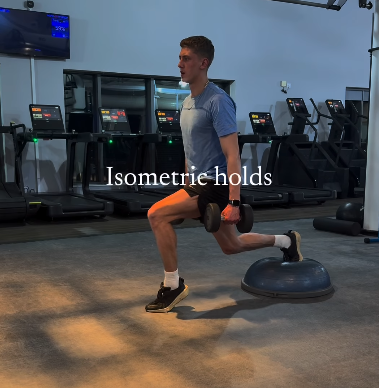
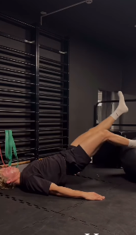
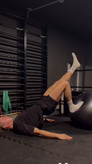

# Copenhaguen Hold
Si es massa complicat es pot recolzar la cama doblegada al terra.
Per complicar-ho es pot posar una pesa recolzada sobre el genoll de la cama doblegada, d'aqueesta manera fas força amb la part interior també.

# Isometric Lounge

# Wall Sit
Es el de tota la vida d'aguantar estona sentat a l'aire amb l'esquena recolzada a la paret

# Yoga Ball Glute Bridge
No és massa isometric però l'he posat aqui perque tampoc cal ser maximament estrictes

