# Important per mantenir la mobilitat
Pot ser que sigui la part del cos més afectada pel fet d'estar sentats. Més que l'esquena fins i tot

## Flamenc

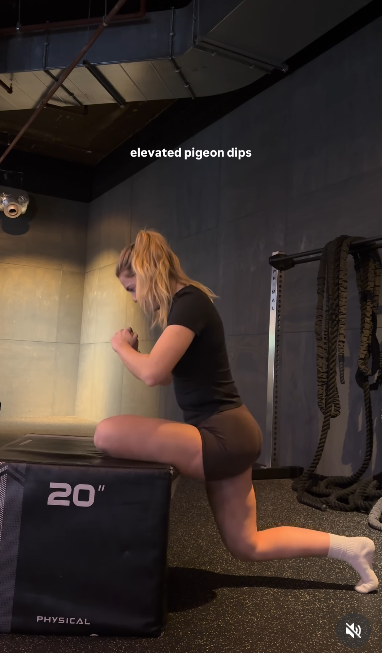
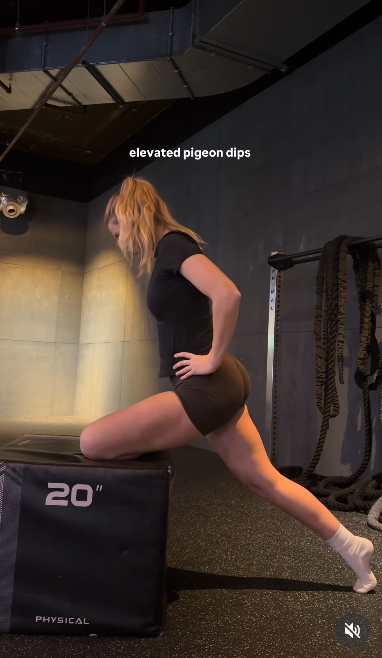

## 90-90

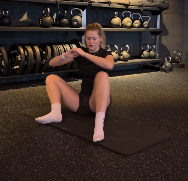
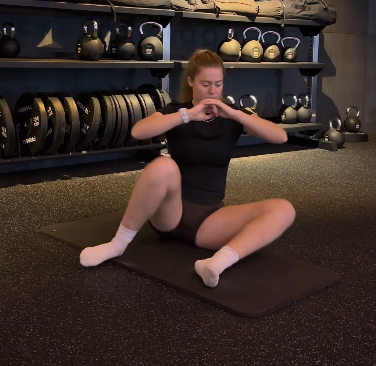
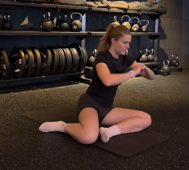
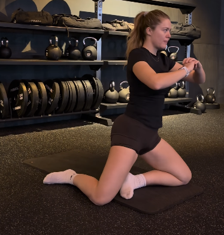

## Pujar-se a la moto

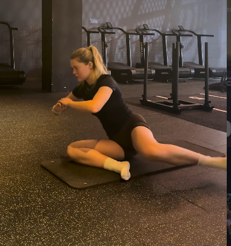
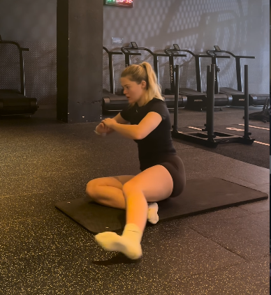
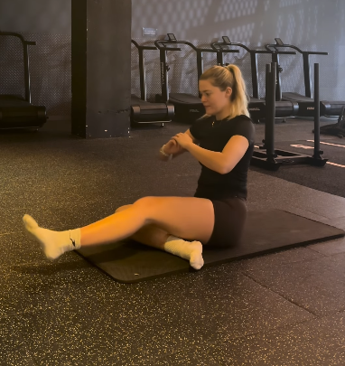

## Aixecament de Cama

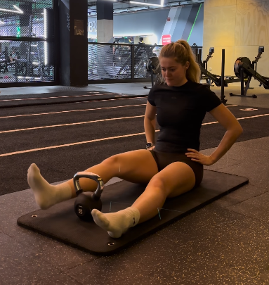
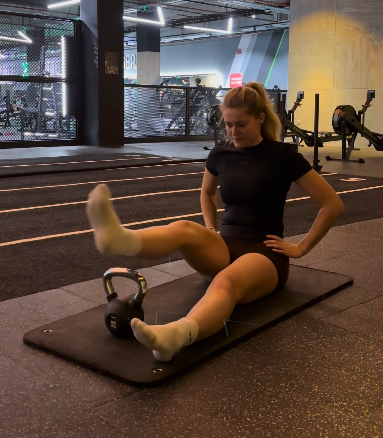
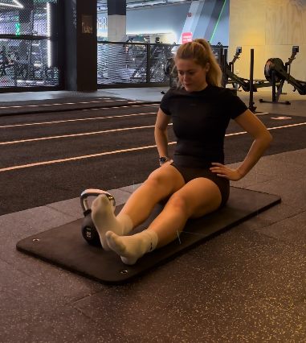

## Pel Hip Flexor

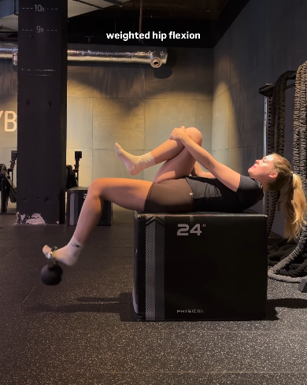
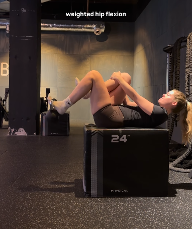

## Entregar l'Anell

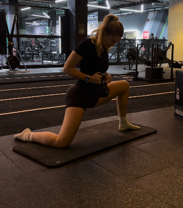
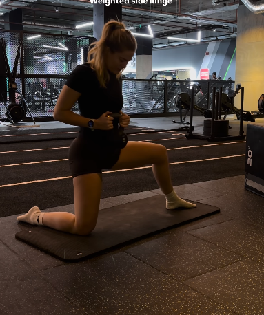
